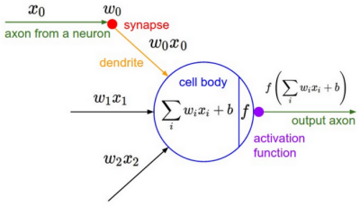
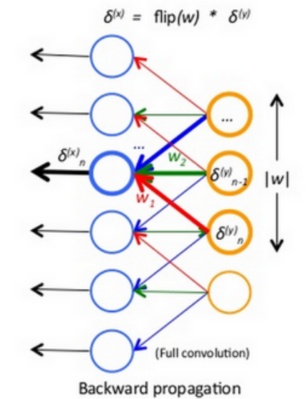

Puzzle Solution
===

## Problem Description
If we have **several samples** as input to a deep network, how is the calculation of the error gradient for weights different from the case when we have a single sample?

For a fully connected layer, the gradient of weight $w_{ij}$
$$d_{w_{ij}} = d_{y_j} * x_i$$
where $x_i$ is the ith input and $y_j$ is the jth output of the layer.

Now if we have two samples: $x_{1i}$ and $x_{2i}$
Is it correct to say that
$$d_{w_{ij}} = d_{y_{1j}} * x_{1i} + d_{y_{2j}} * x_{2i}$$
where $y_{1j}$ and $y_{2j}$ are the corresponding output of $x_{1i}$ and $x_{2i}$ respectively ?

## My Understanding(Solution)

In my understanding, the answer is **NO**. During the calculation of gradients, or the weight updating, the value is calculated neuron by neuron, that's to say that for two connected layers(fully-connected layers are special case as they're also connected), each neuron is connected to previous layer's **receptive field**, so the gradient for this neuron is calculated by the *input* and the *neuron*(or called *filter*) when **forward-propagating**

When using **backpropagation**, tracking back as the same connection relationship, the neuron in current layer is calculated by the next layer's neurons that connect to it, so the output should be **one value** for a neuron, but the input for this calculation should include multiple variables like $x_1$, $x_2$, ...

Taken a very simple situation for example to describe how the neuron is calculated, as the Figure1 shows:

This neuron accepts the $x_0$, $x_1$ and $x_2$ as the input, and generates the output, these three value are three different **position** in last layer's input.

So going back, if there're multiple values for one **position**, how it calculated?(I think that maybe Prof.Zhao's problem)

Then we calculated them **seperately**, which means that do it *one by one*, not just combine them together. For example, the image has RGB channels, so for one position, there're three values, we calculate the output of R, G, B channel one by one, and the output should contain also three feature maps.

This **3** we called the **depth** for a convolution layer. And when we do the computing, the *depth* value is not changed from last layer to current layer.

For more details about this concept of the depth, please check the attach presentation that I made about CNN(P12).

See Figure2 to backpropagation:

