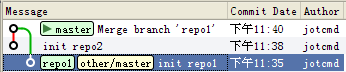

合并已存在的git仓库
===

**需求**：有两个本地的版本库，都是基于一个远程的版本库做开发，现在想将一个版本库的修改合并到另外一个版本库上去，但是不适用服务器端（安全问题）。

**问题**：如何操作本地的两个版本仓库？

###**解决办法**###

总体思路：将本地的一个版本库作为远程版本库，合并到另外一个版本库上。

前期准备：

1. 有2个git仓库：repo1、repo2；
2. 想将repo1中的文件移入repo2；
3. repo1的历史日志要保留；

具体操作如下：

	mkdir repo1
	cd repo1
	git init
	echo "repo1.txt" > repo1.txt
	git add repo1.txt
	git commit -m "init repo1"
 
	mkdir repo2
	cd repo2
	git init
	echo "repo2.txt" > repo2.txt
	git add repo2.txt
	git ci -m "init repo2"

建库完成后，目录如下：

	repo1/
	repo1/repo1.txt
	repo1/.git
 
	repo2/
	repo2/repo2.txt
	repo2/.git

###具体操作：###

1. 在一个版本库中，将本地的另外一个版本库作为远程仓库。比如，这里我在repo2仓库下面，将repo1作为远程仓库。

		# 1、将repo1作为远程仓库，添加到repo2中，设置别名为other
		[jot@myhost repo2]$ git remote add other ../repo1/

2. 在该版本库下面，拉取另外一个版本库的数据到代码仓库中。比如，这里在repo2仓库下面，拉取远程的代码仓库repo1的数据。

		# 2、从repo1仓库中抓取数据到本仓库
		[jot@myhost repo2]$ git fetch other
		warning: no common commits
		remote: Counting objects: 3, done.
		remote: Total 3 (delta 0), reused 0 (delta 0)
		Unpacking objects: 100% (3/3), done.
		From ../repo1
 		* [new branch]      master     -> other/master （此时已有新分支other/master）

3. 新建本地分支，将拉取的数据作为一个新的分支记录下来便于处理。

		# 3、将repo1仓库抓去的master分支作为新分支checkout到本地，新分支名设定为repo1
		[jot@myhost repo2]$ git checkout -b repo1 other/master
		Branch repo1 set up to track remote branch master from other.
		Switched to a new branch 'repo1'

4. 切换回原始的repo2分支，以便进行合并操作。
	
		# 4、切换回repo2的master分支
		[jot@myhost repo2]$ git checkout master
		Switched to branch 'master'

5. 将repo1分支合并到repo2分支（即当前的master分支）上
		
		# 5、将repo1合并入master分支
		[jot@myhost repo2]$ git merge repo1
		Merge made by recursive.
 		repo1.txt |    1 +
 		1 files changed, 1 insertions(+), 0 deletions(-)
 		create mode 100644 repo1.txt

最终的截图如图

###总结：

1. 大致思路是伪造远程的repo1仓库为repo2的一个分支，然后合并进来；
2. 若是文件有冲突、或要建立子目录，建议在repo1中先解决，再进行如上操作。

###参考资料：

1. http://stackoverflow.com/questions/1683531/how-to-import-existing-git-repository-into-another
2. http://progit.org/book/zh/ch2-5.html （推荐阅读）

