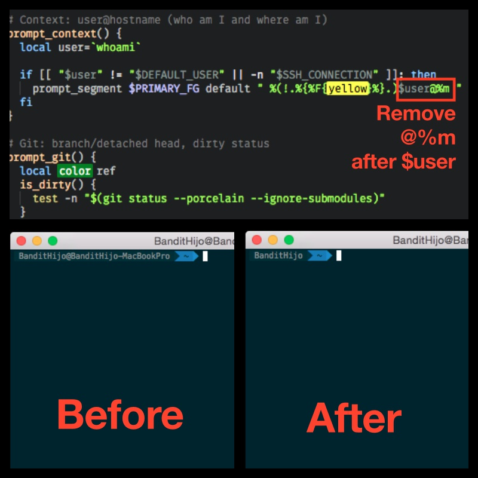

INSTALL
===

## Description

This file describe how to install the zsh in short, mainly focus on how to configure it and what's the problem when using it.

## INSTALL

Use the refer [site](https://github.com/robbyrussell/oh-my-zsh/blob/master/README.markdown) to install the **zsh** for MacOS. We can just directly use `apt-get install zsh` to install under Ubuntu(but we can also the previous site to install it)

NOTICE some file that are important:
	
	* `~/.zshrc`, this file is the user-configuration file to `zsh`, just like the `~/.bashrc`
	* `~/.oh-my-zsh`, this file stores the extended themes/plugins for zsh which makes it more powerful

## Problem Solution

1. Strange code showing

In their github [wiki page](https://gist.github.com/agnoster/3712874), that shows we need to install powerline fonts for these special characters to show normally. According to my experience in Ubuntu and MacOS, it is necessary for both of them to install, but the difference is that:

	* Ubuntu, it needs extra steps as [here](https://powerline.readthedocs.org/en/latest/installation/linux.html#font-installation) shows.
	* MacOS, there is no extra commands needed using this github [repo](https://github.com/powerline/fonts) to install the font

So the difference is that Ubuntu has to use the webpage to manually configure it, but MacOS we can just use the `INSTALL.sh` to install the font under the `/Library/XXX` path.

After that, for **Ubuntu**, it should work; For **MacOS**, make it work by selecting the Terminal's profile and select the font as the `Ubuntu Mono Powerline` font, otherwise it's still not showing correctly.

2. Hide the hostname

In this problem, we want to hide some specific information like `User@localhost-T440s` information, even though in **Ubuntu** there is a lot of people saying that we can juse add the command `export DEFAULT_USER="chang"` or set directly this `DEFAULT_USER="chang"` in the file `~/.zshrc`, I still cannot make it work well. No matter I reboot or logout, it's still useless. I also tried `source ~/.zshrc` to make it work.

After googling some result I finally find it very effect to eliminate the area by deleting the character `%m` in `~/.oh-my-zsh/themes/agnoster.zsh.theme`, this is from the [site](http://stackoverflow.com/questions/28491458/zsh-agnoster-theme-showing-machine-name), like this figure 

So it works well now!

3. Color scheme

It seems that the color for `agnoster` style is not so satisfying, especially the current directory color, that uses the color of **blue**. OMG, it looks so hurt to my eye, so I try to change the color by changing the theme file of `agnoster`, and it succeed, I plan to change it to `green` instead of `blue`, and it looks much better, we can also try `cyan` or other light color.

## Additonal points

When I was doing the research on this tool, I finally find its powerful usage of `zsh`, and it actually worths the time to spend on using it, because even though currently I'm new to it, I still can get some of its new features that bring to me like auto-filling with highlights, maybe I will refer to their official website for some learning to get a better understanding how to use shell to write plugin, how to use this shell well.

And I also get to know that _iTerm2_ is also a very powerful terminal tool under MacOS, this can have powerful search, autofilling, copy-and-paster function that the default Terminal cannot have under MacOS, and it also worths learning for some time, maybe a cup of coffe's time or some TV-seris time, but it definitely worth it. 

And last but not least, remember that **oh-my-zsh** has a powerful plugin and themes, which can be used to test my knowledge of shell, because I find that they are open-source, and they use shell so that it looks like a challenge for me but it really can testify and amuse me.

## Acknowlegement

Thanks to the author of so many open source contributors and thanks to the solvers for the referred bloggers and developers.

## To be done

1. zsh plugin and theme exploring for fun
2. zsh document reading for contributing the code
3. iTerm2's learning for how to use it
4. Tmux with iTerm2 and its uages

**LOOK!** How it can be to extend a large knowledge system to learn, but keep in mind that it worths it!

